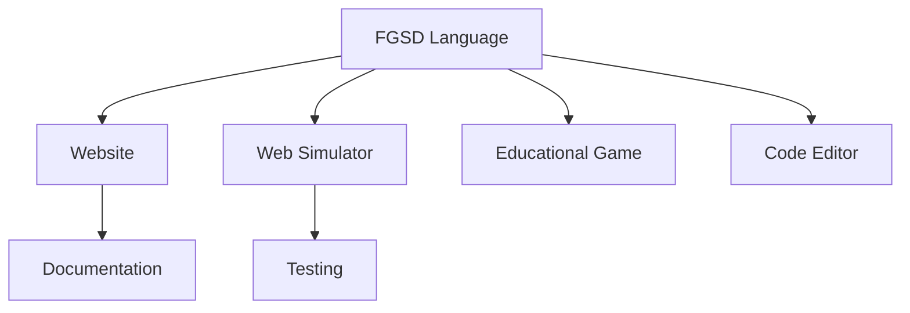

# 🚀 FGSDrones - Open Ecosystem for Robotics Education  

  

**An innovative platform for building and programming drones**  
A complete open-source ecosystem for educational robotics.  

## ✨ Key Components  

| Component | Description | Status |  
|-----------|-------------|--------|  
| 🖥️ **Controllers** | CH32V003 and ESP32-C3 versions | 🚧 In development |  
| ✨ **FGSD Language** | Specialized robotics programming language | α-version |  
| 🌐 **Website** | Official project website | ✅ Live |  
| 🎮 **Web Simulator** | Online code testing environment | 🚧 In development |  
| 🕹️ **Educational Game** | Unity-based 3D simulator | 🚧 Prototype |  
| 💻 **Code Editor** | With syntax highlighting | ✅ Basic functionality |  

## 🛠️ Quick Start  

1. **Visit [official website](https://arduradiokot.github.io/FgSdrones/)**  
2. **Try FGSD language in web editor**:  
```javascript  
init();  
forward(2);  
right(1);  
landing();  
```  
3. **Test code in web simulator** [simulator](https://arduradiokot.github.io/FgSdrones/sim.html)  

## 📊 Technical Specs  

| Feature | CH32V003 Version | ESP32-C3 Version |  
|---------|------------------|------------------|  
| Architecture | RISC-V | RISC-V |  
| Connectivity | USB | USB + Wi-Fi |  
| Sensors | MPU6050 | MPU6050 + additional |  

## 🌍 Ecosystem  




## 🤝 Contribute  

We welcome contributions:  
1. ⭐ Star this repository  
2. 🐞 Report issues  
3. 💡 Suggest improvements via PRs  
4. 📢 Help spread the word  

---  
